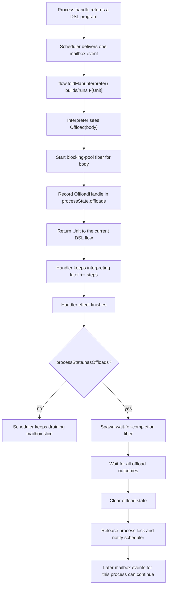
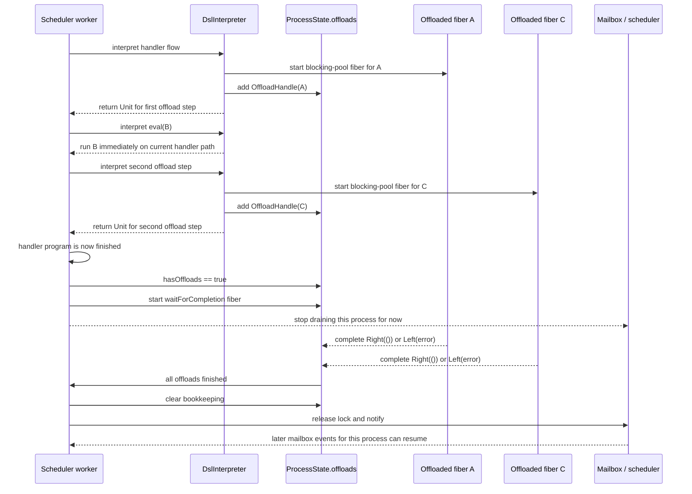

# How `offload { ... }` Works

`blocking { ... }` is now a deprecated alias for `offload { ... }`.
This note describes the actual runtime behavior of that operation.

This note is a quick refresher for the runtime path behind `offload { ... }`.

The main files involved are:

- `parapet-core/src/main/scala/io/parapet/core/Dsl.scala`
- `parapet-core/src/main/scala/io/parapet/core/DslInterpreter.scala`
- `parapet-core/src/main/scala/io/parapet/core/Scheduler.scala`
- `parapet-core/src/main/scala/io/parapet/core/Context.scala`
- `parapet-core/src/main/scala/io/parapet/syntax/FlowSyntax.scala`

## Short version

- `++` is just sequential DSL composition: `fa ++ fb == fa.flatMap(_ => fb)`.
- `offload { body }` does **not** wait for `body` to finish before continuing to the next DSL step.
- Instead, it:
  - starts `body` on a background effect fiber using `Effect.startBlocking(...)`
  - records that background operation in `processState.offloads`
  - returns `Unit` immediately to the current flow
- The scheduler only pauses the **process** after the whole current handler finishes.
- At that point, if any offloaded ops were registered, it waits for all of them before releasing the process lock.

So:

- later steps in the **same handler flow** can run immediately after `offload`
- later **mailbox events for the same process** do not run until all tracked offloads complete

## The layers



## Where each piece lives

### 1. DSL composition

`++` is defined in `FlowSyntax.scala`:

```scala
def ++[B](fb: => DslF[F, B]): DslF[F, B] =
  fa.flatMap(_ => fb)
```

That means:

```scala
offload(a) ++ eval(b) ++ offload(c)
```

is just a sequential free-monad program:

1. run `offload(a)`
2. then run `eval(b)`
3. then run `offload(c)`

### 2. What `offload(...)` means in the DSL

`Dsl.scala` models it as:

```scala
final case class Offload[F[_], G[_], A](body: () => Free[G, A]) extends FlowOp[F, Unit]
```

Important detail:

- the instruction returns `Unit`
- it does **not** return the result of `body`

So `offload` is really "spawn and track this offloaded sub-program", not "await this sub-program".

### 3. Interpreter behavior

In `DslInterpreter.scala`, `Offload(body)` currently does this:

1. allocate `Deferred[F, Either[Throwable, Unit]]`
2. `effect.startBlocking(...)` a blocking-pool fiber for `body.foldMap(...)`
3. complete the deferred with:
   - `Right(())` on success
   - `Left(error)` on failure
4. add `(fiber, completion)` to `processState.offloads`
5. return `Unit` to the enclosing handler flow

That means the current handler continues immediately after the offloaded op has been started and registered.

## Scheduler view

The scheduler does **not** wait inside the interpreter.

Instead, in `Scheduler.Worker.run(processState)`:

1. a worker acquires the process lock
2. it takes one mailbox task
3. it calls `deliver(processState, task)`
4. `deliver` runs the whole handler program via `flow.foldMap(interpreter...)`
5. only after that handler effect finishes, the scheduler checks:

```scala
processState.hasOffloads
```

If `false`:

- the worker keeps draining the mailbox

If `true`:

- the worker starts `waitForCompletion(...)`
- that wait fiber:
  - waits for all offload deferreds
  - raises the first offload error, if any
  - clears offload bookkeeping
  - releases the process lock
  - re-notifies the scheduler

Important consequence:

- while offloaded work is still running, the process lock stays effectively held
- other mailbox events for the same process cannot run yet

## Concrete timeline for `offload { A } ++ eval(B) ++ offload { C }`



## The surprising bit

The most important thing to remember is:

> `offload { ... }` does not pause the current DSL flow right there.

It only causes the scheduler to pause the **process after the current handler finishes**.

So in:

```scala
offload { A } ++ eval(B) ++ offload { C }
```

the order is:

1. start `A`
2. run `B`
3. start `C`
4. finish the handler
5. wait for both `A` and `C`
6. only then allow the next mailbox event for that process

## What can overlap

### Can overlap

- `A` can overlap with `B`
- `A` can overlap with `C`
- `A` and `C` can overlap with each other

### Cannot overlap

- a later mailbox event for the same process cannot start until all tracked offloads are finished
- a second worker cannot run the same process concurrently through the normal mailbox path

## Same-process sends inside the handler

If `eval(B)` or any later step sends to the same process:

- the event is enqueued immediately
- but because the process lock is still held, that queued event waits
- it will only be processed after all tracked offloads complete and the scheduler re-notifies

This is why patterns like:

```scala
offload(work) ++ Done ~> ref
```

mean:

- spawn `work`
- enqueue `Done` to self
- do **not** handle `Done` yet
- handle `Done` only after `work` has finished

## Error path

Offloaded failures are now carried through `Deferred[F, Either[Throwable, Unit]]`.

That means:

- a failing blocking fiber still unblocks the process
- `waitForCompletion` can re-raise that failure
- the scheduler can run its normal error handling path
- the sender can receive `Failure(...)`

## Mental model

If you want one sentence to remember:

> `offload { ... }` is "fork now, remember it, and do not let the process accept the next mailbox event until all remembered blocking work is done."
