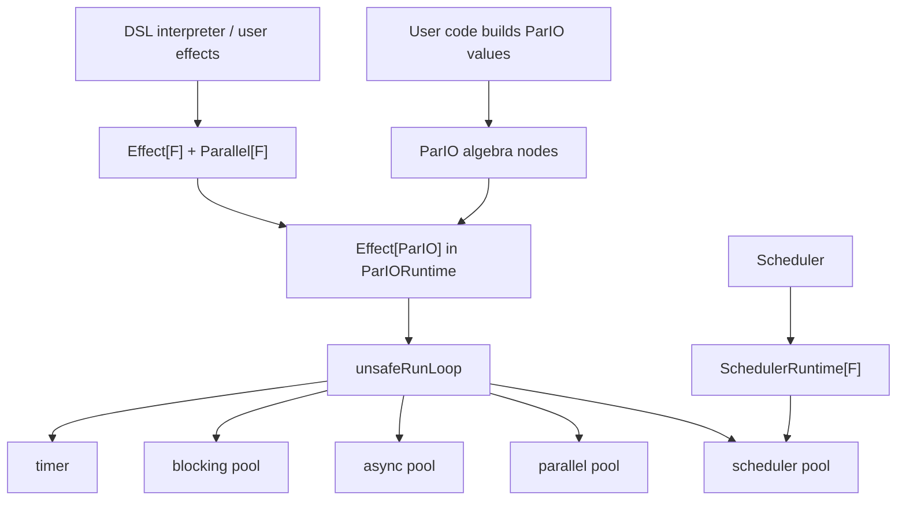
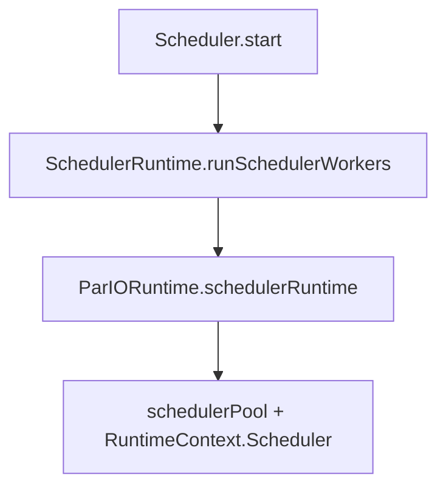
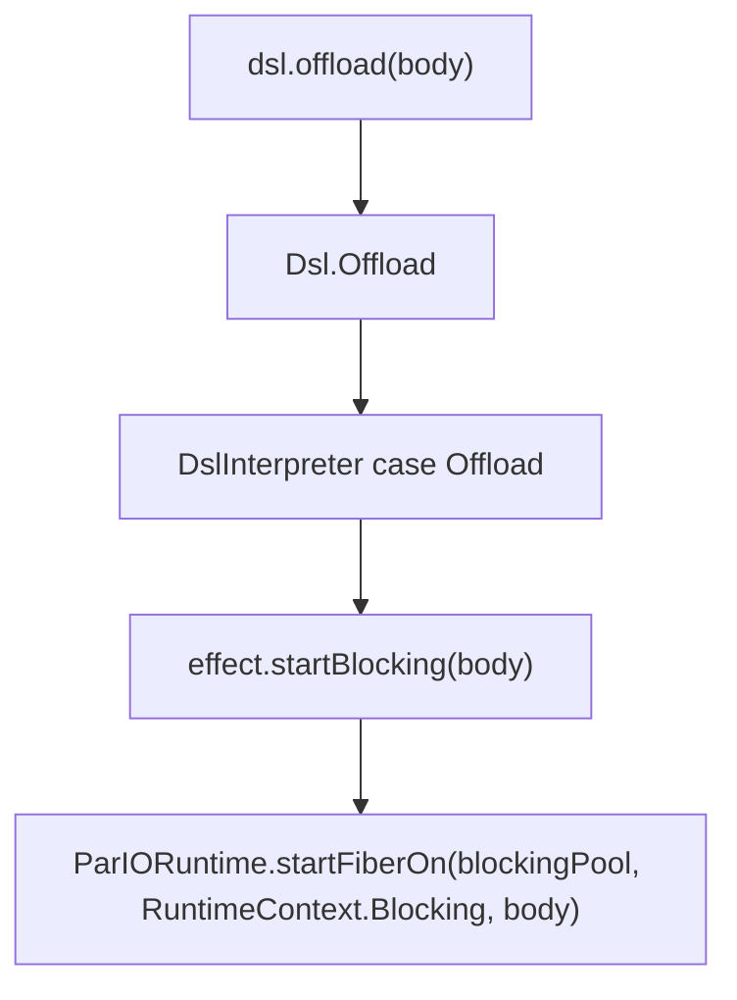

# ParIO Runtime Workbook

This note is a guided reading of the `parapet-pario` reference runtime.

ParIO is intentionally small. It is useful for examples, tests, learning, and runtime experimentation, but it is not the
recommended production backend. Production applications should prefer a mature effect runtime integration such as
`parapet-cats-effect`.

It is meant to be read side by side with these files:

- [ParIO.scala](/Users/dmgcodevil/dev/parapet/parapet-pario/src/main/scala/io/parapet/effect/ParIO.scala)
- [Effect.scala](/Users/dmgcodevil/dev/parapet/parapet-core/src/main/scala/io/parapet/effect/Effect.scala)
- [ParIORuntime.scala](/Users/dmgcodevil/dev/parapet/parapet-pario/src/main/scala/io/parapet/effect/ParIORuntime.scala)
- [SchedulerRuntime.scala](/Users/dmgcodevil/dev/parapet/parapet-core/src/main/scala/io/parapet/core/SchedulerRuntime.scala)
- [Scheduler.scala](/Users/dmgcodevil/dev/parapet/parapet-core/src/main/scala/io/parapet/core/Scheduler.scala)
- [ParIOApp.scala](/Users/dmgcodevil/dev/parapet/parapet-pario/src/main/scala/io/parapet/ParIOApp.scala)
- [DslInterpreter.scala](/Users/dmgcodevil/dev/parapet/parapet-core/src/main/scala/io/parapet/core/DslInterpreter.scala)

The style here is intentional:

- brief explanation of the function first
- then how the implementation works
- then a tiny example or mental model

It should print cleanly on A4 because it avoids wide tables and large code listings.

---

## 1. The three main ideas

### `ParIO[A]`

`ParIO[A]` is the program data type.

It does not run anything by itself. It only describes a computation.

Examples:

```scala
ParIO.pure(42)
ParIO.delay(println("hello"))
ParIO.blocking(scala.io.Source.fromFile("data.txt").mkString)
```

Internally, `ParIO` is a small algebra of nodes:

- `Pure`
- `Delay`
- `Blocking`
- `Suspend`
- `FlatMap`
- `HandleError`
- `Sleep`

So when we write:

```scala
ParIO.delay(1).flatMap(n => ParIO.pure(n + 1))
```

we are building a small tree, not executing code immediately.

### `Effect[F]`

`Effect[F]` is the capability interface the rest of parapet depends on.

This is the reason the scheduler and DSL interpreter can stay generic in `F[_]`.

If some effect type has:

- `given Effect[F]`
- `given Parallel[F]`
- internal `given SchedulerRuntime[F]`

then the core runtime can use it.

That means:

- `ParIO` is one concrete effect
- `Effect` is the abstraction boundary
- `SchedulerRuntime` is the internal scheduler-worker boundary

### `SchedulerRuntime[F]`

`SchedulerRuntime[F]` is a small internal capability used only to run scheduler worker loops.

It exists so `Effect` does not grow a public method like `startScheduler` or `runWorkers`.

That separation matters because scheduler workers are long-lived runtime infrastructure, while `Parallel.par` is for finite
parallel batches of application work.

### `ParIORuntime`

`ParIORuntime` is the interpreter for `ParIO`.

This is where the operational behavior lives:

- the runloop
- thread pools
- scheduler workers
- fibers
- race
- parallel execution
- sleep
- blocking context shift

So the split is:

- `ParIO` = description
- `ParIORuntime` = execution

That split is one of the main cleanup wins in the current version.

---

## 2. One-page architecture



What matters most:

- user/runtime effects talk to `Effect[F]` and `Parallel[F]`
- scheduler workers talk to the internal `SchedulerRuntime[F]`
- `ParIORuntime` is one implementation of those contracts

---

## 3. Reading `ParIO.scala`

The important thing to see in [ParIO.scala](/Users/dmgcodevil/dev/parapet/parapet-pario/src/main/scala/io/parapet/effect/ParIO.scala) is that it is small again.

The sealed trait:

```scala
sealed trait ParIO[+A]
```

and its node types are the abstract syntax tree of the effect.

### Why `map` and `flatMap` are cheap

`map` and `flatMap` do not execute. They just build new nodes:

```scala
final def flatMap[B](f: A => ParIO[B]): ParIO[B] =
  ParIO.FlatMap(this, f)
```

So:

```scala
val p =
  ParIO.pure(10)
    .flatMap(n => ParIO.pure(n + 1))
```

means:

- keep the source program
- keep the continuation function
- let the runtime apply it later

That is exactly why we need a runloop.

### What each node means

- `Pure(value)`  
  A value already known.

- `Delay(thunk)`  
  A pure but lazy thunk.

- `Blocking(thunk)`  
  A thunk that must run in the blocking runtime context.

- `Suspend(thunk)`  
  A delayed constructor of another `ParIO`.

- `FlatMap(source, bind)`  
  Run `source`, then continue with `bind`.

- `HandleError(source, handler)`  
  Run `source`, and if it throws, continue with `handler`.

- `Sleep(duration)`  
  Suspend until the timer fires.

---

## 4. Reading `Effect.scala`

The important mindset for [Effect.scala](/Users/dmgcodevil/dev/parapet/parapet-core/src/main/scala/io/parapet/effect/Effect.scala) is:

> This is not "what ParIO can do".  
> This is "what parapet core needs from any effect runtime".

That is why it extends `Monad[F]` and adds the extra runtime operations:

- `delay`
- `blocking`
- `suspend`
- `raiseError`
- `sleep`
- `start`
- `startBlocking`
- `race`
- `guarantee`

Important wording:

- `blocking(thunk)` means "run the thunk on the runtime's blocking pool"; the current `ParIO` runtime then waits
  synchronously for the result.
- `sleep(duration)` means "suspend for this duration"; the current `ParIO` runtime implements that suspension with a
  timer plus a blocking-pool wait.
- neither method currently promises true async suspension.

### Why `startBlocking` exists

This is one of the key runtime changes.

Before, ordinary background work and offloaded blocking work were too close together.

Now there is a deliberate split:

- `start(fa)`  
  Run `fa` in the async runtime context.

- `startBlocking(fa)`  
  Run `fa` in the blocking runtime context.

That lets the DSL mean something more honest:

- `fork` uses `start`
- `offload` uses `startBlocking`

### Why scheduler workers are not in `Effect`

`Effect` is visible to ordinary code through `summon[Effect[F]]`, so it should not expose a method that can run arbitrary
work on scheduler threads.

Scheduler workers use `SchedulerRuntime[F]` instead:

- it is package-private to parapet
- it is required by `Scheduler`, not by user programs
- it is implemented by `ParIORuntime` with a dedicated scheduler pool

### What `EffectFiber` means

`EffectFiber[F, A]` is a handle to a running effectful computation:

- `join: F[A]`
- `cancel: F[Unit]`

So a fiber is not the computation itself. It is the handle used to observe or stop that computation.

---

## 5. Reading `ParIORuntime.scala`

[ParIORuntime.scala](/Users/dmgcodevil/dev/parapet/parapet-pario/src/main/scala/io/parapet/effect/ParIORuntime.scala) is the most important file now.

Read it in this order:

1. config types
2. runtime context model
3. effect, parallel, and scheduler-runtime instances
4. `unsafeRunLoop`
5. algebraic `guarantee`
6. fiber helpers
7. race/parallel helpers
8. scheduler-worker helper
9. blocking/timer helpers

One important boundary: `unsafeRun` is package-private. Workbook snippets that call `runtime.unsafeRun(...)` are
internal/runtime/test-style examples, not public user API examples.

---

## 6. Runtime configuration and contexts

`ParIORuntime` owns five runtime resources:

- `schedulerPool`
- `parallelPool`
- `asyncPool`
- `blockingPool`
- `timer`

They correspond to five logical roles:

- scheduler worker context
- finite parallel work context
- background async context
- blocking/offload context
- timer wakeup role

| Runtime ownership |
| --- |
| `schedulerPool`: long-lived scheduler worker loops |
| `parallelPool`: finite `Parallel.par` batches |
| `asyncPool`: ordinary fibers from `Effect.start` |
| `blockingPool`: blocking waits and `offload` |
| `timer`: wakeup scheduling |

The blocking pool is intentionally used for more than user I/O. In the current runtime, `join`, `blocking`, and `sleep`
all consume real threads while waiting. That is honest but not fully asynchronous.

### Why scheduler has its own pool

Scheduler workers are long-lived loops. `Parallel.par` is for finite batches of application work.

If scheduler workers share `parallelPool`, then a stress case with `numberOfWorkers == parallelPool.size` can occupy every
parallel thread forever. Submitters, process work, or other finite `Parallel.par` batches then have nowhere to run.

So scheduler workers use `SchedulerRuntime[F]`, and `ParIORuntime.schedulerRuntime` runs them on `schedulerPool`.

### Why a `RuntimeContext` enum exists

The runtime has:

```scala
private enum RuntimeContext:
  case External, Scheduler, Parallel, Async, Blocking
```

and a thread-local:

```scala
private val runtimeContextLocal = new ThreadLocal[RuntimeContext]()
```

This is a small but important trick.

It lets the runtime know:

- where a computation is currently running
- whether it already is in the blocking runtime context

That is used by `runBlocking`:

- if already in `RuntimeContext.Blocking`, run inline
- otherwise submit to the blocking pool and synchronously wait

`RuntimeContext` is internal bookkeeping. It is not a public API for choosing pools.

Without that check, blocking work could re-submit itself forever or create useless extra handoffs.

---

## 7. The runloop: `unsafeRunLoop`

This is the heart of the runtime.

### Brief explanation

`unsafeRunLoop` is the interpreter for `ParIO`.

Its job is:

1. inspect the current `ParIO` node
2. decide what to do next
3. keep track of pending continuations
4. return a value or throw an uncaught error

### The two core variables

The center of the method is:

```scala
var current: ParIO[Any] = io.asInstanceOf[ParIO[Any]]
var stack: List[Frame]  = Nil
```

These two variables are the whole trampoline.

### What `current` means

`current` is the node being interpreted right now.

Examples:

- `Pure(42)`
- `Delay(() => 1 + 1)`
- `FlatMap(source, bind)`

At each loop iteration, the runtime pattern-matches on `current`.

### What `stack` means

`stack` is a heap-allocated continuation stack.

It is not the JVM call stack.

That difference is the key to stack safety.

Instead of recursive calls like:

```scala
run(source)
run(bind(result))
run(next)
```

the runtime stores "what to do next" in `stack` and keeps looping.

### What a `Frame` is

A `Frame` is one suspended continuation.

Current frame types:

- `BindFrame(run)`
- `RecoverFrame(run)`

Meaning:

- `BindFrame` = "when you get a value, continue with this `flatMap` function"
- `RecoverFrame` = "if you get an error, continue with this recovery function"

### Why this is stack-safe

Suppose we write:

```scala
def loop(n: Int): ParIO[Int] =
  if n <= 0 then ParIO.pure(0)
  else ParIO.pure(()).flatMap(_ => loop(n - 1))
```

This can build a very deep chain of `FlatMap` nodes.

If the runtime used plain recursion, the JVM call stack would grow with every bind.

Instead, `unsafeRunLoop`:

- pushes continuations into `stack`
- stays inside one `while true` loop
- uses constant JVM stack depth

That is the classic trampoline idea.

---

## 8. Walking through a tiny example

Take this program:

```scala
val io =
  ParIO.pure(1)
    .flatMap(n => ParIO.pure(n + 1))
    .flatMap(n => ParIO.delay(n * 10))
```

The runtime first sees a nested program tree:

```scala
FlatMap(
  FlatMap(Pure(1), f1),
  f2
)

where
f1 = n => ParIO.pure(n + 1)
f2 = n => ParIO.delay(n * 10)
```

In the tables below, the top row is the top of the continuation stack.

### Step 0

`current = FlatMap(FlatMap(Pure(1), f1), f2)`

| Continuation stack |
| --- |
| _(empty)_ |

### Step 1

The outer `FlatMap` pushes `f2`, then moves into its source.

`current = FlatMap(Pure(1), f1)`

| Continuation stack |
| --- |
| `BindFrame(f2)` |

### Step 2

The inner `FlatMap` pushes `f1`, then moves into `Pure(1)`.

`current = Pure(1)`

| Continuation stack |
| --- |
| `BindFrame(f1)` |
| `BindFrame(f2)` |

### Step 3

`Pure(1)` pops `BindFrame(f1)` and computes the next node.

`current = Pure(2)`

| Continuation stack |
| --- |
| `BindFrame(f2)` |

### Step 4

`Pure(2)` pops `BindFrame(f2)` and computes the delayed node.

`current = Delay(() => 20)`

| Continuation stack |
| --- |
| _(empty)_ |

### Step 5

`Delay(() => 20)` runs its thunk and becomes `Pure(20)`.

`current = Pure(20)`

| Continuation stack |
| --- |
| _(empty)_ |

No deep recursive JVM call chain is needed.

---

## 9. Reading the `unsafeRunLoop` cases

### `Pure(value)`

Briefly:

- if there is no pending continuation, we are done
- otherwise feed the value to the next continuation

Implementation idea:

```scala
case Pure(value) =>
  stack match
    case Nil => return value
    case BindFrame(run) :: tail =>
      current = run(value)
      stack = tail
    case RecoverFrame(_) :: tail =>
      current = Pure(value)
      stack = tail
```

Why `RecoverFrame(_)` is skipped on success:

- error handlers matter only on failure
- a successful value should pass through them untouched

### `Delay(thunk)`

Briefly:

- evaluate the thunk now
- wrap the result as `Pure`

Implementation:

```scala
case Delay(thunk) =>
  current = Pure(thunk())
```

The important subtlety:

- exceptions thrown by `thunk()` are caught by the outer `try/catch`
- so `handleErrorWith` still works

### `Blocking(thunk)`

Briefly:

- run the thunk through the blocking runtime-context helper
- then continue as `Pure(result)`

Implementation:

```scala
case Blocking(thunk) =>
  current = Pure(runBlocking(thunk()))
```

The context-shift logic is not inside the algebra node. It is inside the runtime helper.

### `Suspend(thunk)`

Briefly:

- force a delayed `ParIO`
- continue with that program

Implementation:

```scala
case Suspend(thunk) =>
  current = thunk()
```

This is important when you want laziness at the level of building the next `ParIO`.

### `FlatMap(source, bind)`

Briefly:

- do not run `bind` yet
- first remember it as a continuation
- then move into `source`

Implementation:

```scala
case FlatMap(source, bind) =>
  current = source
  stack = BindFrame(bind) :: stack
```

This is the single most important stack-safety move in the whole runtime.

### `HandleError(source, handler)`

Briefly:

- do not run `handler` yet
- first remember it as an error continuation
- then move into `source`

Implementation:

```scala
case HandleError(source, handler) =>
  current = source
  stack = RecoverFrame(handler) :: stack
```

### `Sleep(duration)`

Briefly:

- wait until a timer fires
- then continue with `Pure(())`

Implementation:

```scala
case Sleep(duration) =>
  sleepOnTimer(duration)
  current = Pure(())
```

This is cleaner than `Thread.sleep`, but still not fully asynchronous, because the runloop waits synchronously.

---

## 10. How error handling works

If any node throws, the outer `catch` runs.

The runtime then scans `stack` until it finds a `RecoverFrame`.

### Brief explanation

Success uses `BindFrame`.

Failure uses `RecoverFrame`.

So the continuation stack stores both:

- normal "what next"
- error "what next"

### Example

```scala
val boom = new RuntimeException("boom")

val io =
  ParIO.raiseError[Int](boom)
    .flatMap(n => ParIO.pure(n + 1))
    .handleErrorWith(_ => ParIO.pure(123))
    .flatMap(n => ParIO.pure(n * 2))
```

The decomposed shape is:

```scala
FlatMap(
  HandleError(
    FlatMap(Delay(() => throw boom), f1),
    h
  ),
  f2
)

where
f1 = n => ParIO.pure(n + 1)
h  = _ => ParIO.pure(123)
f2 = n => ParIO.pure(n * 2)
```

Right before the error is raised, the stack looks like this:

`current = Delay(() => throw boom)`

| Continuation stack |
| --- |
| `BindFrame(f1)` |
| `RecoverFrame(h)` |
| `BindFrame(f2)` |

When `Delay` throws, the catch block scans from the top:

1. it skips `BindFrame(f1)` because that continuation only applies on success
2. it finds `RecoverFrame(h)`
3. it sets `current = h(error)`, which becomes `Pure(123)`
4. it drops the handled prefix and keeps the tail below the handler

After recovery starts, the stack is:

`current = Pure(123)`

| Continuation stack |
| --- |
| `BindFrame(f2)` |

### `guarantee` is algebraic

`Effect.guarantee(fa)(finalizer)` is not implemented by re-entering the interpreter inside `ParIO.delay`.

It is built from ordinary `ParIO` nodes:

```scala
fa
  .handleErrorWith { originalError =>
    finalizer
      .handleErrorWith { finalizerError =>
        originalError.addSuppressed(finalizerError)
        ParIO.raiseError[Unit](originalError)
      }
      .flatMap(_ => ParIO.raiseError[A](originalError))
  }
  .flatMap(value => finalizer.flatMap(_ => ParIO.pure(value)))
```

That keeps finalization inside the same runloop.

Behavior:

- if `fa` succeeds, run `finalizer`, then return the original value
- if `fa` fails, run `finalizer`, then rethrow the original error
- if both `fa` and `finalizer` fail, rethrow the original error with the finalizer error suppressed
- if `fa` succeeds but `finalizer` fails, fail with the finalizer error

---

## 11. `startFiberOn`

This is one of the most important helper methods.

### Brief explanation

`Effect.start(fa)` calls `startFiberOn(asyncPool, RuntimeContext.Async, fa)`.

`Effect.startBlocking(fa)` calls `startFiberOn(blockingPool, RuntimeContext.Blocking, fa)`.

`startFiberOn` takes:

- an executor
- a runtime context label
- a `ParIO[A]`

and returns an `EffectFiber[ParIO, A]`.

So its job is:

1. submit a program to some executor
2. run the `ParIO` program there
3. capture its result or failure
4. return a fiber handle with `join` and `cancel`

### Implementation shape

It creates:

- a `CompletableFuture[A]` called `result`
- an `AtomicBoolean` called `started`
- an `AtomicReference[Thread]` called `runner`
- a submitted executor task

The executor task does:

1. mark the fiber as started
2. remember the running thread in `runner`
3. set the runtime context with `withRuntimeContext`
4. call `unsafeRunLoop(fa)`
5. complete `result` with success or failure
6. clear `runner` before returning the executor thread to the pool

That means the fiber handle does not store the result directly. It stores a future that will eventually contain it.

### Why `join` is implemented with `ParIO.blocking`

`join` is:

```scala
def join: ParIO[A] =
  ParIO.blocking(await(result))
```

That means:

- joining a running fiber is a potentially blocking wait
- so it is forced into the blocking runtime context

This is a good and honest choice for the current runtime.

### Why `cancel` treats pending and running fibers differently

The runtime does not yet have sophisticated fiber cancellation semantics.

So `cancel` is still best-effort, but it has two important responsibilities:

1. a fiber that never starts must still complete `result` with `CancellationException`
2. a fiber that has started should be interrupted and given a short chance to finish its cleanup

The current implementation calls `task.cancel(true)` first. If the task has not started, cancellation may prevent it from
ever running, so the runtime completes `result` with `CancellationException`. That prevents `join` from waiting forever.

If the task has started, cancellation interrupts the executor task and the recorded runner thread if available. Then it
waits up to five seconds for `result` to settle. That bounded wait gives `guarantee` finalizers and interruptible cleanup
code a chance to run before `cancel` returns.

If the running fiber still has not completed after that bounded wait, `cancel` completes `result` with
`CancellationException`. The underlying executor task may still continue if user code ignores interruption, but future
`join` calls will not hang forever.

Clearing `runner` matters because executor threads are reused. A completed fiber must not keep a stale reference to a pool
thread that might later be running unrelated work.

### Success, failure, cancellation, interruption

On success:

- the executor task completes `result` with the value from `unsafeRunLoop(fa)`
- `join` returns that value

On failure:

- the executor task completes `result` exceptionally
- `join` unwraps `ExecutionException` through `await` and rethrows the original cause

On cancellation:

- `cancel` calls `task.cancel(true)`, which is Java executor best-effort cancellation
- if the fiber has not started, `result` is completed exceptionally with `CancellationException`
- if the fiber has started, the recorded runner thread is interrupted if available
- a started fiber gets up to five seconds to complete `result` through normal success/failure cleanup
- if that wait times out, `result` is completed exceptionally with `CancellationException`
- cancelling an already completed fiber does not interrupt any pool thread

On interruption:

- `cancel` is itself a `ParIO.blocking` action, so waiting inside cancellation follows `runBlocking` rules
- if the caller running `cancel` is interrupted during the bounded wait, interrupt status is restored and `result` is
  completed exceptionally with `CancellationException`
- the actual running fiber only stops if the underlying code notices interruption or reaches an interruptible wait

### Tiny example

If we call:

```scala
val fiber = runtime.unsafeRun(runtime.effect.start(ParIO.delay(1 + 1)))
val value = runtime.unsafeRun(fiber.join)
```

then:

1. `start` uses `startFiberOn(asyncPool, RuntimeContext.Async, ...)`
2. a background task runs `unsafeRunLoop`
3. the result future is completed with `2`
4. `join` waits for that future in the blocking runtime context

---

## 12. `racePrograms`

### Brief explanation

`racePrograms(left, right)` runs two programs concurrently and returns whichever finishes first.

Result type:

```scala
Either[A, B]
```

Meaning:

- `Left(a)` means the left side won
- `Right(b)` means the right side won

### Implementation idea

It uses `ExecutorCompletionService`.

That class is useful because it lets us:

- submit several tasks
- then wait for the first completed one

The method:

1. submits left and right onto the async pool
2. tags them as `0` or `1`
3. waits for the first completed result
4. cancels the loser
5. returns the winner

### Why tagging is needed

Both sides eventually produce a value of some unknown type.

So the helper wraps each completion as:

```scala
RaceResult(tag: Int, value: Any)
```

The tag tells us which side completed.

### Success, failure, cancellation, interruption

On success:

- the first successfully completed side becomes the result
- the losing future receives `cancel(true)`
- loser cancellation is best-effort; code that ignores interruption may continue briefly

If one side finishes by throwing:

- `completion.take().get()` throws `ExecutionException`
- the method unwraps `getCause`
- the other side receives `cancel(true)`
- the underlying cause is rethrown

If the thread waiting in `completion.take()` is interrupted:

- both futures receive `cancel(true)`
- the interrupt flag is restored with `Thread.currentThread().interrupt()`
- the `InterruptedException` is rethrown

Failures from the losing side after the winner has already been chosen are not reported to the caller.

### Example

```scala
runtime.unsafeRun(
  runtime.effect.race(
    ParIO.sleep(1.second).flatMap(_ => ParIO.pure("slow")),
    ParIO.pure("fast")
  )
)
```

Expected result:

```scala
Right("fast")
```

because the right side finishes first.

---

## 13. `runParallel`

### Brief explanation

`runParallel` is the implementation of `Parallel[ParIO].par`.

It delegates to:

```scala
runAllOnPool(effects, parallelPool, RuntimeContext.Parallel)
```

Its job is:

1. run many `ParIO[Unit]` effects on the parallel pool
2. wait for all of them
3. fail fast if one fails
4. cancel the rest on failure

### Why this is not the same as `race`

`race` cares about the first finisher.

`runParallel` cares about:

- all successes, or
- the first observed failure

So it uses the same `ExecutorCompletionService` idea, but with a different loop.

### Implementation

1. submit every effect to `parallelPool`
2. store the resulting futures
3. keep a counter `remaining`
4. repeatedly call `completion.take().get()`
5. decrement `remaining` on success
6. on failure, cancel everyone and rethrow the cause
7. if the group exits abnormally, cancel incomplete futures

This is a good pattern for fail-fast parallel execution on top of Java executors.

### Success, failure, cancellation, interruption

On success:

- all submitted effects complete
- no futures are cancelled after normal completion
- the caller resumes with `Unit`

On failure:

- the first observed `ExecutionException` is unwrapped
- the underlying cause is rethrown
- incomplete futures receive `cancel(true)` in cleanup
- already completed effects are left alone
- if submission itself fails partway through, already submitted futures are also cleaned up

On interruption:

- `completion.take()` throws `InterruptedException`
- the interrupt flag is restored
- incomplete futures receive `cancel(true)`
- the `InterruptedException` is rethrown

On cancellation:

- there is no separate `Parallel.par` cancellation token
- if the fiber running `runParallel` is interrupted, the interruption path above performs best-effort cancellation
- child effects only stop promptly if they respond to interruption

### What does not use `runParallel`

Scheduler workers do not use `Parallel.par`.

`Scheduler.start` calls the internal `SchedulerRuntime[F]` capability, and `ParIORuntime.schedulerRuntime` runs those
workers on `schedulerPool`.



That protects `parallelPool` from permanent worker loops.

Scheduler workers use the same `runAllOnPool` mechanics with `schedulerPool` and `RuntimeContext.Scheduler`.

That means:

- if all workers complete, scheduler startup completes normally
- if one worker fails, incomplete workers receive `cancel(true)` and the failure is rethrown
- if the waiting scheduler thread is interrupted, incomplete workers receive `cancel(true)` and interrupt status is restored
- scheduler workers are long-lived, so normal completion usually means shutdown or an unusual worker exit

### Example

```scala
runtime.unsafeRun(
  runtime.parallel.par(
    Seq(
      ParIO.delay(println("a")),
      ParIO.delay(println("b")),
      ParIO.delay(println("c"))
    )
  )
)
```

The effects run in parallel pool threads, and the method returns only when all have completed.

If one throws, the caller sees that error directly.

---

## 14. `runBlocking`

### Brief explanation

`runBlocking` ensures a thunk runs in the blocking runtime context.

### Implementation rule

```scala
Option(runtimeContextLocal.get()) match
  case Some(RuntimeContext.Blocking) => thunk
  case _                             => await(submitThunk(blockingPool, RuntimeContext.Blocking)(thunk))
```

So:

- already in the blocking runtime context -> run inline
- otherwise -> submit and wait

The "wait" part is important. This shifts the thunk itself to the blocking pool, but the caller still waits
synchronously for the result. It is not fully asynchronous suspension.

### Example context handoff

If an async fiber reaches `ParIO.blocking(thunk)`, the runtime context movement looks like this:

| Runtime context timeline |
| --- |
| `Async`: `unsafeRunLoop` reaches `Blocking(thunk)` |
| `Async`: `runBlocking` submits the thunk and waits |
| `Blocking`: the submitted thunk runs on a blocking worker |
| `Async`: the original runloop resumes with `Pure(result)` |

### Why this matters

This avoids unnecessary re-submission when blocking code itself calls another blocking operation.

Without that check:

- blocking work could bounce between threads for no reason
- nesting `blocking` would be much noisier

### Success, failure, cancellation, interruption

On success:

- the thunk result is returned to the original runloop

On failure:

- exceptions thrown by the thunk are unwrapped by `await`
- the original cause is rethrown into the runloop
- ordinary `handleErrorWith` can catch it

On interruption:

- if the thread waiting in `await` is interrupted, `await` restores the interrupt flag and throws `InterruptedException`
- the currently submitted blocking thunk is not cancelled by `runBlocking`
- that means the blocking thunk may continue until it finishes or observes its own interruption

On cancellation:

- `runBlocking` has no independent cancellation token
- cancellation depends on the outer fiber/task being interrupted

---

## 15. `sleepOnTimer`

### Brief explanation

`sleepOnTimer` implements `ParIO.Sleep`.

It uses:

- the timer executor to schedule a wakeup
- a `CompletableFuture[Unit]` as the wakeup signal
- `runBlocking` to wait for that signal in the blocking runtime context

### How it works

1. create `signal`
2. schedule `signal.complete(())` after `duration`
3. wait for `signal`
4. cancel the scheduled task if needed

### Context handoff

`Sleep` changes runtime contexts in two steps: the wakeup is scheduled on the timer executor, and the wait happens in the
blocking context.

This does not park the fiber or free the original runtime thread. The original runloop synchronously waits for the
blocking-pool wait to finish.

| Runtime context timeline |
| --- |
| original context reaches `Sleep(duration)` |
| original context schedules a wakeup on the timer executor |
| blocking context waits for the wakeup signal |
| timer executor completes the signal |
| original context resumes with `Pure(())` |

This is better than raw `Thread.sleep`, because:

- timekeeping is handled by the timer executor
- the waiting happens in the blocking context, not inline in whatever context called sleep

But it is still synchronous from the runloop's point of view.

That is one of the main remaining limitations.

### Success, failure, cancellation, interruption

On success:

- the timer completes the signal
- the blocking-pool wait returns
- the original runloop continues with `Pure(())`

On failure:

- ordinary timer completion does not create a failure
- failures can still come from interruption or executor shutdown

On interruption:

- interruption while waiting is restored and rethrown by `await`
- if the blocking-pool wait itself is interrupted before the signal completes, the scheduled timer task is cancelled
- if only the original runtime thread waiting for the blocking-pool task is interrupted, the blocking-pool wait may continue
  until the timer fires

On cancellation:

- `sleepOnTimer` has no separate cancel token
- cancellation is best-effort through interrupting the fiber/task that is currently waiting
- this is why true async sleep would require an async callback node in `ParIO`

---

## 16. `withRuntimeContext` and `await`

These methods are small, but they explain a lot of runtime behavior.

### `withRuntimeContext`

Briefly:

- set the thread-local runtime context
- run the thunk
- restore the previous runtime context

This is how nested runtime calls preserve context correctly.

### `await`

Briefly:

- wait for a Java `Future`
- unwrap `ExecutionException` into the real cause
- let direct `CancellationException` propagate
- rethrow an unwrapped `CancellationException` when it is the `ExecutionException` cause
- re-interrupt the current thread on `InterruptedException`

That is the bridge between Java executor APIs and the effect runtime.

---

## 17. How `offload` reaches the runtime

This is the most relevant end-to-end example for parapet users.

In [DslInterpreter.scala](/Users/dmgcodevil/dev/parapet/parapet-core/src/main/scala/io/parapet/core/DslInterpreter.scala), the `Offload` case does:

1. build the effectful body
2. start it with `effect.startBlocking(...)`
3. convert body success/failure into `Either[Throwable, Unit]`
4. complete a `Deferred` with that outcome
5. track the fiber and deferred in the process offload tracker

So the path is:



This is why the new `startBlocking` primitive matters. It gives `offload` a runtime meaning distinct from plain `fork`.

Behavior:

- the offloaded body runs on the blocking pool for `ParIO`
- the handler flow continues after the offload is started and registered
- the scheduler waits for tracked offloads before releasing that process
- if an offload body fails, the failure is stored in the deferred and re-raised when the scheduler waits
- if tracked offloads are cancelled during process cleanup, their fibers are cancelled and their deferreds are completed
- cancellation is still best-effort interruption, because it delegates to `EffectFiber.cancel`

---

## 18. Review checklist

When reading the code, these are the best questions to ask.

### About `ParIO`

- Is the algebra minimal but sufficient?
- Are the node names honest?
- Are `flatMap` and `handleErrorWith` represented cleanly?

### About `Effect`

- Is every method truly needed by parapet core?
- Does `startBlocking` belong at this boundary?
- Do `blocking` and `sleep` avoid promising true async suspension?
- Does `Effect` avoid exposing scheduler-worker APIs?
- Are the semantics understandable for other possible runtimes?

### About `SchedulerRuntime`

- Is it still package-private/internal?
- Is `SchedulerImpl.start` the only ordinary caller?
- Do tests that touch it deserve special review?

### About `ParIORuntime`

- Is the runtime context model clear?
- Are the pool defaults reasonable?
- Are scheduler workers isolated from `Parallel.par`?
- Is `unsafeRunLoop` easy to reason about?
- Are `startFiberOn`, `racePrograms`, and `runParallel` correct under failure?
- Is `guarantee` still algebraic rather than re-entering with nested `unsafeRun` calls?
- Are interruption and cancellation honest about their limits?

### About remaining limitations

- Where do we still synchronously wait?
- Which operations still consume real threads while waiting?
- What would require a true async callback node to improve further?

---

## 19. What would move this closer to 8/10

Without trying to become Cats Effect, the biggest next upgrades would be:

1. add a true async callback node to `ParIO`
2. make `sleep` fully asynchronous instead of synchronously waiting
3. improve cancellation semantics beyond interruption-based best effort
4. revisit blocking pool defaults once waits no longer consume blocking threads the same way

Those are the biggest design moves left.

---

## 20. Sources worth studying

These are the most useful sources for understanding or validating this style of runtime.

### Book

- *Functional Programming in Scala* by Chiusano and Bjarnason  
  Best source for the mindset behind algebraic descriptions of effects, trampolining, and interpreters.

### Paper / article

- Runar Bjarnason, *Stackless Scala With Free Monads*  
  Very useful for understanding why the `current` + `stack` trampoline pattern exists at all.

### Standard library concept

- Scala `TailCalls` and trampoline-style interpreters  
  Good for the general idea of turning recursive interpretation into iterative stepping.

### Runtime design references

- Cats Effect thread model
- Cats Effect scheduler/runtime docs
- JDK `ThreadPoolExecutor` docs

These are especially useful for:

- compute vs blocking separation
- cancellation tradeoffs
- timer design
- pool sizing and rejection behavior

---

## 21. Final mental model

If you want one compact summary, use this:

`ParIO` is a small program tree. `Effect` is the public capability boundary for ordinary effects, `Parallel` is for finite
parallel batches, and `SchedulerRuntime` is the internal boundary for long-lived scheduler workers. `ParIORuntime` is the
interpreter that walks the tree with a trampoline (`current` + `stack`), and when needed it hands work to scheduler,
parallel, async, and blocking runtime contexts, with the timer executor handling wakeups.

That is the whole picture.
