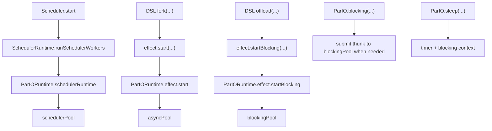

# Runtime Threading

This note describes how threads are used by the `parapet-pario` reference runtime.

## Short version

`ParIO` now has separate executors for:

- scheduler/parallel work
- async/forked work
- blocking/offloaded work
- timer wakeups

That is a real improvement over the old single cached pool.

One important nuance:

- the default blocking pool is still elastic/cached in spirit
- that is deliberate for now, because the current synchronous runloop would otherwise reject too aggressively under
  heavy blocking, sleep, join, or queue-wait pressure

The important remaining limitation is this:

- the `ParIO` runloop is still synchronous
- so `blocking(...)` and `sleep(...)` still wait synchronously inside the runloop
- this is cleaner than before, but it is not yet a fully asynchronous runtime like Cats Effect

## Main files

- [ParIO.scala](/Users/dmgcodevil/dev/parapet/parapet-pario/src/main/scala/io/parapet/effect/ParIO.scala)
- [ParIORuntime.scala](/Users/dmgcodevil/dev/parapet/parapet-pario/src/main/scala/io/parapet/effect/ParIORuntime.scala)
- [Scheduler.scala](/Users/dmgcodevil/dev/parapet/parapet-core/src/main/scala/io/parapet/core/Scheduler.scala)
- [DslInterpreter.scala](/Users/dmgcodevil/dev/parapet/parapet-core/src/main/scala/io/parapet/core/DslInterpreter.scala)

## The executors

`ParIORuntime` owns:

- `parallelPool`
- `asyncPool`
- `blockingPool`
- `timer`

Config lives in:

- `FixedPoolConfig`
- `ElasticPoolConfig`
- `TimerThreadPoolConfig`
- `ParIORuntimeConfig`

Construction is centralised in `Pools.fixed` / `Pools.elastic` / `Pools.scheduled` so the "elastic" vs. "fixed"
semantics live in one place.

Source:

- [ParIORuntime.scala](/Users/dmgcodevil/dev/parapet/parapet-pario/src/main/scala/io/parapet/effect/ParIORuntime.scala)

## Scheduler workers

The scheduler starts workers via:

```scala
schedulerRuntime.runSchedulerWorkers(workers.map(_.run))
```

For `ParIO`, that goes through the runtime's internal `SchedulerRuntime[ParIO]` instance and uses the dedicated scheduler
pool.

So:

- scheduler workers run on the scheduler pool
- they do not share the same executor as `Parallel.par`, `fork(...)`, or `offload(...)`

## `fork(...)`

DSL `fork(...)` eventually calls:

```scala
effect.start(...)
```

For `ParIO`, `Effect.start` submits onto the async pool.

So:

- `fork(...)` uses the async pool

## `offload(...)`

DSL `offload(...)` eventually calls:

```scala
effect.startBlocking(...)
```

For `ParIO`, `Effect.startBlocking` submits onto the blocking pool.

So:

- `offload(...)` uses the blocking pool
- it no longer competes with scheduler workers or finite parallel work

## `ParIO.blocking(...)`

`ParIO.blocking(...)` builds a `ParIO.Blocking(...)` node.

In the runtime:

- if already in the blocking context, the thunk runs inline
- otherwise the thunk is submitted to the blocking pool and awaited

This means `blocking(...)` is now a real runtime-context shift, not just a semantic marker.

However, it is still not fully asynchronous, because the runloop is synchronous and waits for the submitted blocking
task to finish.

## `Fiber.join`

`Fiber.join` eventually calls the underlying effect-fiber `join`.

For `ParIO`, that `join` is wrapped in:

```scala
ParIO.blocking(...)
```

So joining a fiber uses the blocking pool rather than the async or parallel pools.

## `sleep(...)`

`Sleep(duration)` now uses the timer executor plus the blocking context.

That is better structured than raw `Thread.sleep`, but it still waits synchronously from the runloop's point of view.

So this is **not yet** a fully asynchronous timer implementation.

## End-to-end map



## Practical consequences

### 1. We now have real executor separation

That is the biggest concrete improvement:

- parallel work is isolated from async work
- async work is isolated from offloaded blocking work

### 2. `offload(...)` now matches its name much better

It no longer uses the same executor as `fork(...)`.

### 3. The runtime is still synchronous at its core

This is the next thing to remember during review:

- `ParIO` does not yet have a true async callback node
- so this is still not the same class of runtime as Cats Effect `IO`

## Current answer in one sentence

Today, `ParIO` has separate configurable scheduler, parallel, async, blocking, and timer executors, and `offload(...)`
uses the blocking context, but the runloop is still synchronous and not yet fully asynchronous.
